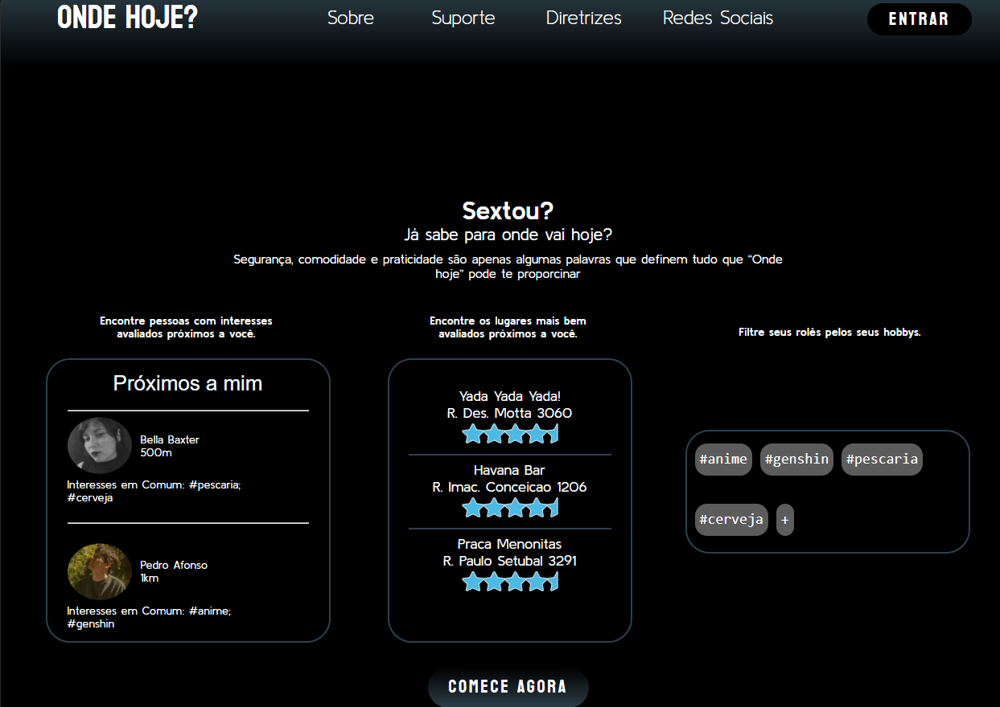
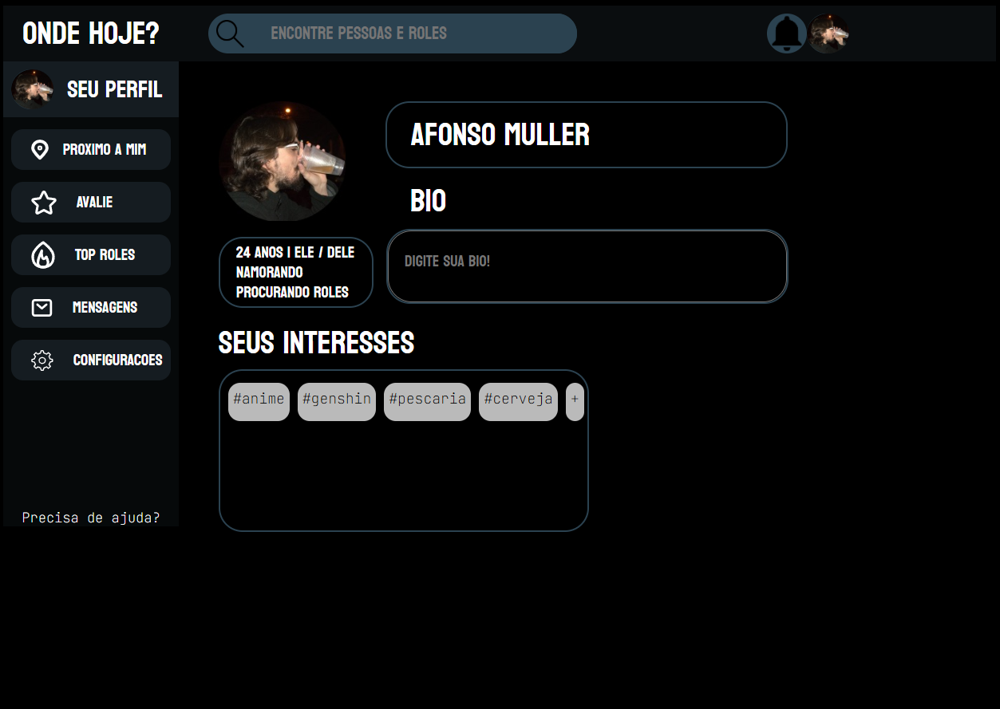
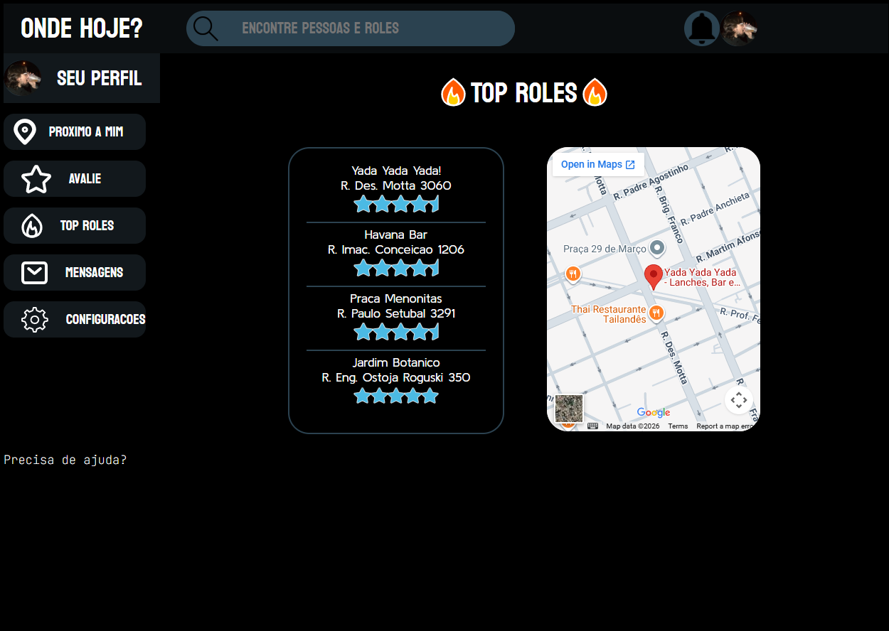

# Onde Hoje? 📅

O **Onde Hoje?** é um protótipo de plataforma voltada para a descoberta de eventos, lugares e pessoas com interesses em comum, com foco na interação entre universitários.

O projeto foi desenvolvido em equipe durante o **1º período de Sistemas de Informação na PUCPR** e foi reconhecido como **melhor trabalho do período**, destacando-se pela proposta e apresentação do projeto.

🔗 [Confira a publicação do reconhecimento no LinkedIn](https://www.linkedin.com/posts/joselainevalaski_hoje-foi-o-dia-de-premiar-a-equipe-com-o-activity-7186517360529313792-Jlzg)

## 🎯 Objetivo

O projeto teve como objetivo representar o conceito de uma plataforma que ajudaria estudantes a:

- Encontrar pessoas próximas com interesses em comum
- Descobrir lugares e atividades próximos
- Avaliar locais
- Encontrar e compartilhar interesses
- Explorar diferentes funcionalidades relacionadas à vida universitária

Além da proposta da plataforma, o projeto serviu para aplicar conceitos fundamentais de desenvolvimento web aprendidos durante o primeiro período.

## 🛠️ Tecnologias utilizadas

- **HTML5** — Estrutura e organização das páginas
- **CSS3** — Estilização, layout e identidade visual
- **JavaScript** — Scripts e funcionalidades básicas de navegação

## 📸 Preview

### Página inicial

### Perfil

### Top Roles

## 👥 Equipe

Projeto desenvolvido em equipe por estudantes de Sistemas de Informação da PUCPR:

- [**Gustavo Delinski Tavares**](https://www.linkedin.com/in/gustavo-delinski-tavares/)
- [**Afonso Muller**](https://www.linkedin.com/in/afonso-muller/)
- [**Gabriel Baczinski Santana**](https://www.linkedin.com/in/gabrielbaczinski/)
- [**João Pedro Cardoso de Liz**](https://www.linkedin.com/in/jcliz/)
- **Lucas Bigardi Ribeiro**

## 🎓 Contexto acadêmico

Projeto desenvolvido como parte das atividades acadêmicas do **1º período de Sistemas de Informação da PUCPR**.

O trabalho foi reconhecido como **melhor trabalho do período**, recebendo destaque pela proposta apresentada pela equipe.
